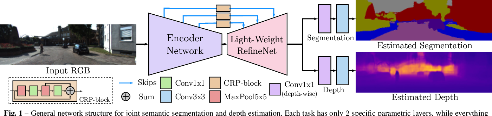
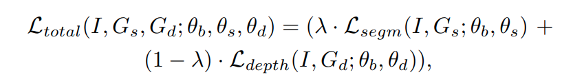
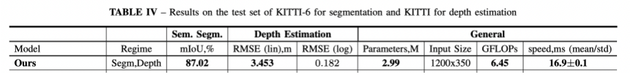
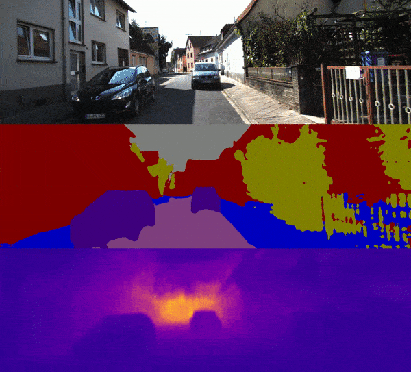

# Real Time Joint Semantic Segmentation & Depth Estimation
The following is an implementation of the paper [Real Time Joint Semantic Segmentation & Depth Estimation Using Asymmetric Annotations](https://arxiv.org/pdf/1809.04766.pdf) in PyTorch.

## Introduction

## Dataset
In the paper, two main datasets are considered: NYUDv2 and KITTI, representing indoor and outdoor settings, respectively.

- NYUDv2 is an indoor dataset with 40 semantic labels.
It contains 1449 RGB images with both segmentation and
depth annotations
- KITTI is an outdoor dataset with 20 semantic labels. It contains 200 samples for segmentation
20,000 images for depth estimation.

To account for the uneven distribution of the classes and tasks in the datasets, the paper adopts what's called Knowledge distillation, which refers to a training procedure for a neural network that transfers the knowledge from a teacher network to a student network. Particularly:

> "Due to similarities with the CityScapes dataset, we consider ResNet-38 trained on CityScapes as our teacher network to annotate the training images that have depth but not semantic segmentation. In turn, to annotate missing depth annotations on 100 images with semantic labels from KITTI-6, we first trained a separate copy of our network on the depth task only, and then used it as a teacher."

So, the Hydranet was firstly trained on the KITTI dataset for depth estimation, then knowledge from the Resnet38 was transferred to the Hydranet for semantic segmentation as well.

## Model
The proposed architecture relies on a [Light-Weight RefineNet](https://arxiv.org/abs/1810.03272) architecture built on top of the MobileNet-v2 classification network. This architecture extends the classifier by appending several simple contextual blocks, called Chained Residual Pooling (CRP), consisting of a series of 5 × 5 max-pooling and 1 × 1 convolutions.

The branching happens right after the last CRP block, and two additional convolutional layers (one depthwise 1 × 1 and one plain 3 × 3) are appended for each task 

## Loss
The paper uses the standard softmax cross-entropy loss for segmentation and the inverse Huber loss for depth estimation. The total loss contains an additional scaling parameter, λ, set to 0.5 for simplicity.

## Results
The following table shows the results from the paper:

Here's an inference test:

